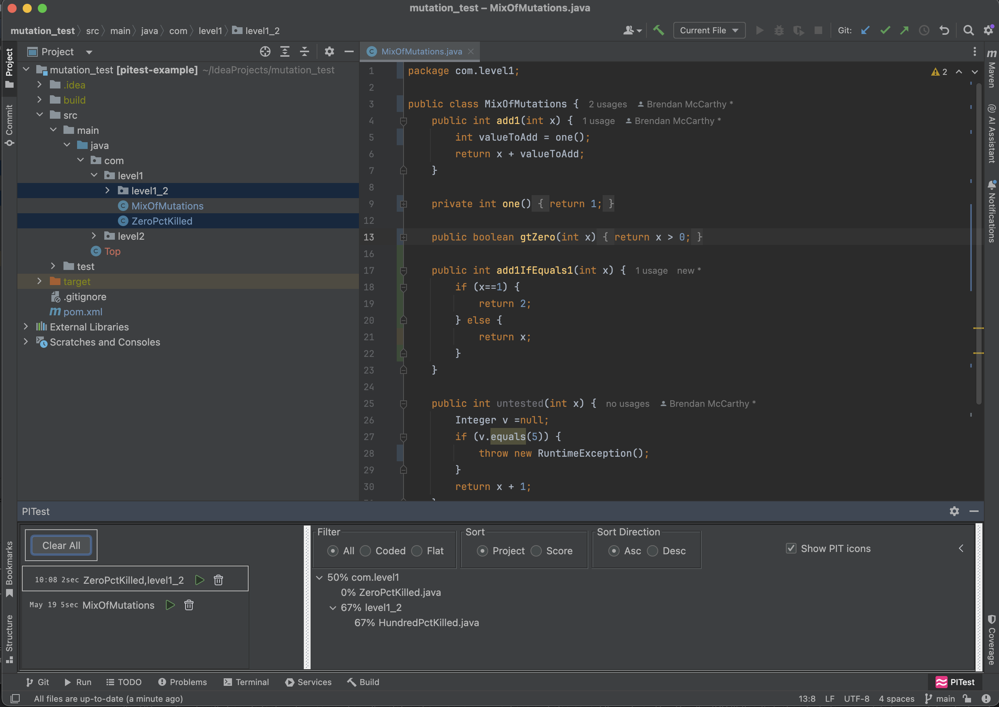

# pitest-idea

<!-- Plugin description -->
Run [PIT](https://pitest.org) mutation tests from Intellij IDEA. Features:

* Run against any combination of files -- automatically matches sources and tests
* See mutation icons directly in IDE or jump to a browser view
* Sort/filter results, see score breakdown
* View and re-execute previous runs

Currently, only Java and Maven projects are supported.
<!-- Plugin description end -->

## Getting Started

Select "Run PITest for This File" from the editor menu on any Java file (left).
After a while, a popup appears when PITest has completed (middle). Choose the "Show Report" option.
The results (right) show the score in the toolwindow at the bottom of the screen, and the applied mutations
in the editor window.

  
&nbsp; &nbsp; &nbsp; &nbsp;
  
&nbsp; &nbsp; &nbsp; &nbsp;
  

Alternatively, you can select any combination of files and packages from the project or package view (below left), 
again choosing to "Show Report" (below middle).
The toolwindow becomes more interesting, showing results across multiple files along with filtering and sorting
options and history (below right).

  
&nbsp; &nbsp; &nbsp; &nbsp;
  
&nbsp; &nbsp; &nbsp; &nbsp;
  

PIT is run in the background and should not impact IDE performance while it runs. Do be aware however that PIT can 
take a while for large test scopes with many input files, or packages with extensive progeny. 
You can always open the PIT window directly from its toolwindow icon and see the status of any ongoing executions 
and also cancel them if you like. See the [PIT](https://pitest.org) site for more details on its execution.

## FAQ

#### 1. <i>How does the plugin identify what tests to run for a given set of inputs?</i>

For package directories, it matches equivalent path between test and source. 
For files, it matches between source and test files using standard naming conventions, e.g. "FooTest.java" to "Foo.java". 
If you need an alternate mix, e.g. if your test for "Foo.java" is "MyTest.java", 
you can multi-select and run both from the project menu. 
This matching also works in the reverse direction if you select test files first. 

In all cases, the plugin removes redundant entries to simplify the collection of inputs. For example, if you select
both a file and its package, then only the package will be listed as part of the input since that file is included
implicitly.
This is both more efficient and streamlines long lists of input sets when selecting from the project menu.
The final inputs can be seen in the tooltip on entries in the history list.

#### 2. <i>Where are results stored?</i>

In the output build directory (look for "pit-idea-reports" if interested). 
The practical considerations of this are that:
<ul>
<li>If you do a 'clean' outside the IDE they will be removed just like everything else</li>
<li>They are written from a PITest run but loaded back only at startup time, so there is no impact if they are deleted while the IDE is running
</ul>

## Future Enhancements

<ul>
<li>Kotlin support
<li>Gradle support
<li>Excludes
<li>Run deltas
<li>VCS-relative partial execution
</ul>

