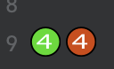

# pitest-idea

<!-- Plugin description -->
Run [PIT](https://pitest.org) mutation tests from IntelliJ IDEA. Features:

* Run against any combination of Java files -- automatically matches sources and tests
* See mutation icons directly in IDE or jump to a browser view
* Sort/filter results, see score breakdown
* View and re-execute previous runs
* Visual indicators provide insights into how test changes impact results across runs
* Generate prompts with mutation result contexts for LLM unit test generation
* Maven and Gradle support

<!-- Plugin description end -->

## Current limitations

* Java only, no Kotlin
* Can be run in multi-module projects, but the selected tests and source must be in the same module (no cross-module
  support for test in a separate module from source)
* No advanced customization of the PIT command, such as excludes

## Configuration

Supports recent versions of junit5, out of the box with no additional configuration.
See [here](https://bmccar.github.io/pitest-idea/configuration.html) for cases where additional build file configuration
may be necessary.

## Getting Started

Select "Run PITest for This File" from the editor menu on any Java file (below left).
After a while, a popup appears when PITest has completed (below middle). Choose the "Show Report" option.
The results (below right) show the score in the toolwindow at the bottom of the screen, and the applied mutations
in the editor window.

  
&nbsp; &nbsp; &nbsp; &nbsp;
  
&nbsp; &nbsp; &nbsp; &nbsp;
  

Alternatively, you can select any combination of source and test files and packages from the project
or package view (below left), again choosing to "Show Report" (below middle) from the popup.
The toolwindow becomes more interesting, showing results across multiple files along with filtering and sorting
options and history (below right).

  
&nbsp; &nbsp; &nbsp; &nbsp;
  
&nbsp; &nbsp; &nbsp; &nbsp;
  

PIT is run in the background and should not impact IDE performance while it runs. PIT can
take a while (hours even) for large test scopes with many input files or packages with extensive progeny, so be
aware that some time will elapse until the results popup appears.
You can always open the plugin toolwindow directly from its icon (lower right in the diagrams above) and see the status
of any ongoing executions and also cancel them if desired.
See the [PIT](https://pitest.org) site for more details on its execution.

### Change Tracking

When making test changes and re-running PITest from the command line, it can be challenging to remember what the
previous results were and understand what impact your test changes achieved. The plugin helps by providing
indicators wherever a run differs from the one preceding it. This shows up in three places.

#### Change Tracking in the ToolWindow

In the toolwindow, the % difference relative to the previous run is displayed, if different. This appears after the
score in parentheses with a green up arrow (which indicates improvement) or a red down arrow (the opposite). If the
difference is greater than zero, the % difference will also be shown:

#### Change Tracking in the Score Popup

Clicking on the score (underlined in the image above) shows a breakdown of how the score was calculated. Any value that
differed from the previous
run will include the delta change. Any green arrow indicates an improvement, while any red arrow indicates the opposite:

#### Change Tracking in the editor

Each line that had a change from the previous run will have two icons, one for each.
The left icon is for the most recent one, while the right icon is for the run before that.

### Help With Improving Your Tests

Improving your mutation results can sometimes be challenging. The plugin can help by generating LLM prompts for you.
Clicking on any of the icons in the code editor opens a popup with a suggested 
prompt for the enclosing method (all the icons within a method produce the same prompt):

You can copy the prompt and paste in any LLM input (such as JetBrains own AI Assistant) to generate unit tests 
oriented toward improving your mutation score.
This doesn't _always_ result in effective tests and is obviously dependent on LLM capabilities, but the additional
context in this prompt can sometimes guide the LLM to generate better results than more generic prompts.

### Console Pane

PIT generates output while it runs which is captured in the <i>console pane</i>. This is not visible by default when
a PIT execution succeeds, as in the examples above.
If PIT fails for any reason, a popup gives you a choice to ignore or view the PIT output in the console pane.
It can also be seen at any time by clicking on the ">" icon button in the upper right of the scores pane where output
scores are shown. It can be similarly hidden by clicking on the ">" button in the upper right of the scores pane,
though you might have to horizontally scroll rightward if that ">" button is not visible.

## FAQ

#### 1. <i>How does the plugin identify what tests to run for a given set of inputs?</i>

For package directories, it matches the equivalent path between test and source.
For files, it matches between source and test files using standard naming conventions, e.g. "FooTest.java" to
"Foo.java."
If you need an alternate mix, e.g., if your test for "Foo.java" is "MyTest.java,"
you can multi-select and run both from the project menu. This matching also works in the reverse direction if you select
test files first,
but only if you haven't also included any source files.

In all cases, the plugin removes redundant entries to simplify the collection of inputs. For example, if you select
both a file and its package, then only the package will be listed as part of the input since that file is included
implicitly.
This is both more efficient and streamlines long lists of input sets when selecting from the project menu.
The final inputs can be seen in the tooltip on entries in the history list.

#### 2. <i>Where are results stored?</i>

In the output build directory (look for "pit-idea-reports" if interested).
The practical considerations of this are that:

* If you do a 'clean' outside the IDE, they will be removed just like everything else
* They are written from a PITest run but loaded back only at startup time, so there is no impact if they are deleted
  while the IDE is running

## Troubleshooting

First, make sure your project compiles. The plugin initiates an incremental build before execution, so PIT won't even
be attempted if the project does not compile. Also, PIT sometimes complains about "No mutations found" if the project
wasn't built properly — "Rebuild all" can fix this.

Second, make sure your tests (those targeted for a given run) pass. PIT will start but will exit with an error if it
can't run the tests. You'll see an error in the console pane if this is the case.

Third, check for any classpath problems. See the [Configuration](configuration.html) page for guidance on handling
classpath problems.
You can make use of the controls on top of the console pane in the toolwindow for more information:

* The "Verbose" checkbox will run the <i>next</i> PIT execution in verbose mode, capturing all verbose output from PIT.
* The "Show Classpath..." button displays the classpath used for the <i>last</i> PIT execution.

If none of the above helps, feel free to file a bug report [here](https://github.com/bmccar/pitest-idea/issues) with
appropriate information from the
sources above.

